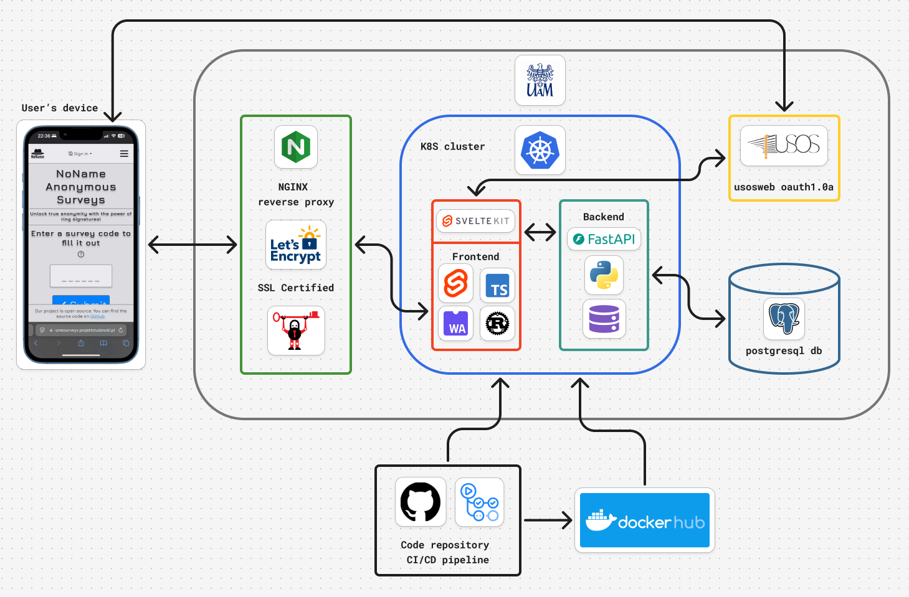

# 🔐 NoName Anonymous Surveys

**NoName Anonymous Surveys** is an open-source platform designed for conducting truly anonymous surveys. Using linkable ring signature technology, it ensures that:

#### - ✅ Responses are verifiable as being from members of a designated group.
#### - ✅ Respondent identities remain entirely anonymous.
#### - ✅ Each user can respond only once to a survey.

You are free to use, modify, and host your own instance of the platform. Setup instructions and tips are provided below.

---

## 🚀 Example Use Case

### Check out the example instance for the **University of Adam Mickiewicz** [here](https://nonamesurveys.projektstudencki.pl/).
> [!NOTE]
> Keep in mind that this instance can be accessed only by students and staff of the university.

### A Diagram of our infrastructure:


---

## 📖 User's Guide

### **Generate Keys**
1. Go to the **Account** section in the navigation bar.
2. Enter a **passphrase** (used to encrypt and decrypt your keys later).
3. Confirm the passphrase by entering it again.
4. Click on **Generate**.
5. Save the keys in a secure location.

> [!IMPORTANT]
> The keys are used in the cryptographic protocol and are generated locally on your device.
> **Do not lose your keys** - they are required for you to answer private surveys.

---

### **Create a Survey**
1. Navigate to the **Create** section in the navigation bar.
2. Fill out the survey title and questions - see what [question types](#question-types) you can use below.
3. Optionally:
  - Save a draft [for later use](#managing-drafts) by clicking **Save Draft**.
  - Preview the survey by clicking **Preview** (and go back to editing mode by clicking **Edit**).
4. Once the survey is ready, click **Finish**.
5. Choose who can respond to the survey:
  - **Secure** (restricted to specific users or groups):
    - Select a user group from the list or add users by email.
    - Ensure all users have registered and generated their keys.
  - **Public** (open to everyone).
6. Click **Finish** again to finalize.
7. You will now be presented with a survey code and a QR code that you can share with others.

---

### **Respond to a Survey**
1. Open a survey by either:
    - Clicking on a survey link that you received.
    - Navigating to the **Fill Out** section in the navigation bar and providing the survey code.
    - Scan the QR code that has been shared with you.
2. Fill out the form with your responses.
3. If the survey has a restricted access, you will be asked to **load your keys** and **enter the passphrase** you have generated during keys creation.
4. Click **Submit**.

---

### **View Survey Results**
1. Navigate to the **Surveys** section in the navigation bar.
2. Click on the survey you are interested in.
3. You will see the summary of responses but will be able to see individual responses if you nagivate to the **Answers** tab.

---

### **Managing Existing Surveys**
#### Navigate to the **Surveys** section in the navigation bar and look at the survey you are interested in.

1. Deactivate (or activate) a survey.
  - If the "turn off" icon visible next to the survey is blue, it means the survey is active.
  - Click on the "turn off" icon to deactivate the survey, it should turn red.
  - If you want to activate the survey again, click on the "turn on" icon, it should turn blue again.
  - If the said button is grey, it means you are not the owner of the survey and you cannot change its status.

> [!NOTE]
> Deactivating a survey will prevent users from responding to it.
> You can still view the results of a deactivated survey and activate it again at any time.

---

2. Delete surveys:
  - Select the surveys you want to delete by clicking on the checkbox on the left side of the survey.
  - Click on the **Delete** button.

> [!WARNING]
> Deleting a survey is irreversible and you will lose access to all responses.

---

3. Export a survey:
  - Click on the survey title of a survey you are interested in.
  - Click on the **Export** button.
  - Choose where you want to save the file and save it.
  - The survey will be downloaded in a specific format that can be later imported.

---

4. Import a survey from a file:
  - Click on the **Import** button.
  - Select a file with a survey in the correct format.
  - Click **Submit**.

> [!NOTE]
> The file should be in a specific format, you can see it by exporting a survey.
> This action only allows you to view the historic summary of the survey - it does not change the survey's status.

---

5. Share invitation to a created survey:
  - Click on the survey code of a given survey in the **Access Code** column.
  - Copy the link, survey code or QR code and share them with others.

---

6. See possible respondents of a secure survey:
  - Click on the number of a given survey in the **Group Size** column of a secure survey.
  - You will see a list of users who can respond to the survey anonymously and only once.
  - N/A means that the survey is public and everyone can respond to it.

---

7. Manage access to results of your survey:
  - Click on the survey title of a survey you are interested in.
  - Click on the **Share** button at the bottom of the page.
  - You can see the list of users who already have access to the survey results.
  - To remove users from the list, click on the checkbox next to their email and click **Delete**.
  - To add users:
    - Click on the **+ Users** button.
    - Select users by email from the list or import them from a CSV file.
    - Click **Submit**.

---

### **Managing Existing Drafts**
#### Navigate to the **Drafts** section in the navigation bar and look at the draft you are interested in.

1. Edit a draft:
  - Click on the draft title of a draft you are interested in.
  - You will now be able to interact with the draft as if it was a survey.

---

2. Delete drafts:
  - Select the drafts you want to delete by clicking on the checkbox on the left side of the draft.
  - Click on the **Delete** button.

> [!WARNING]
> Deleting a draft is irreversible and you will lose access to it.

---

3. Create a survey from a draft:
  - Click on the blue checkmark icon in the **Create** column of a draft you are interested in.
  - Follow the same steps as when creating a survey.

---

### **Create a User Group**
1. Navigate to the **Groups** section in the navigation bar.
2. Click on the **+ Group** button.
3. Fill out the group name.
4. Add users by email or import them from a CSV file.
5. Click **Submit**.

---

### **Managing Existing User Groups**
#### Navigate to the **Groups** section in the navigation bar and look at the group you are interested in.

1. Edit a group:
  - Click on the **Group Name* of a group you are interested in.
  - You will now see the list of users in the group.
  - To add users:
    - Click on the **+ Members** button.
    - Select users by email from the list or import them from a CSV file.
    - Click **Submit**.
  - To remove users:
    - Click on the checkbox next to their email and click **Delete**.

2. Delete groups:
  - Select the groups you want to delete by clicking on the checkbox on the left side of the group.
  - Click on the **Delete** button.

> [!WARNING]
> Deleting a group is irreversible and you will lose access to it.

3. Rename a group:
  - Click on the **Rename** icon of a group you are interested in.
  - Enter a new group name.
  - Click **Submit**.

> [!NOTE]
> The user group name must be unique.

---

## 🤔 Explanations

### **Linkable Ring Signature**
- **Linkable Ring Signature** is a cryptographic protocol that allows specifying groups of possible signers. When submiting answer to a secure survey, you generate a signature which is then verified by the server.
- **How does the server know I am a member of the group?** - The group of respondents is determined by the set of public keys of its members. The signature generated by you contains a zero knowledge proof of your knowledge
of a private key corresponding to some public key in this group. This allows the server to verify that you know this key, but its value remains secret.
- **How does the server know I have already answered the survey?** - During signature generation, you compute a special value using the entire set of public keys and your private key. For a given group, this value will always be
the same for the same user. However, it is mathematically infeasible to recover the private key used to compute this value, so you remain anonymous.
---

## 📚 Additional Information

### 🧅 If you want to be extra careful, and wish to enhance your anonymity further, we recommend using the [Tor](https://www.torproject.org/download/) browser. Tor routes your internet traffic through a network of servers, encrypting it multiple times and masking your IP address to obscure your location and activity. This ensures that platform administrators, as well as other parties, cannot trace your actions back to your device or monitor your browsing activity effectively.


### ❓ **Question Types**
- **Text** - allows the respondent to enter a free-form text response.
- **Number** - allows the respondent to enter a numerical response.
- **Single** - allows the respondent to select one option from a list of choices.
- **Multi** - allows the respondent to select multiple options from a list of choices.
- **Binary** - allows the respondent to select one of two options (e.g., yes/no).
- **Scale** - allows the respondent to select a value from a range (e.g., 1-5).
- **Slider** - allows the respondent to select a value by moving a slider.
- **List** - allows the respondent to select one option from a list of choices (e.g., dropdown).
- **Rank** - allows the respondent to rank a list of choices in order of preference.

### 🌐 Sharing the Website
- You can share a QR code by clicking on the **Invite** button at the bottom of the page after going to the **Account** section.
- You can also share the website with others by providing them with the link: [https://nonamesurveys.projektstudencki.pl/](https://nonamesurveys.projektstudencki.pl/)

### 🔑 AMU USOS Authentication
- The platform uses the AMU USOS API for authentication.
- You need to have an AMU USOS account to log in to the platform.
- If you are a student or a staff member of the University of Adam Mickiewicz, you can log in using your AMU USOS credentials.
- It makes it easier both for us and for you to verify your identity.

### 👁️ Accessibility
- We strive to make the platform accessible to everyone.
- If you encounter any issues or have suggestions for improvement, please let us know.
- You can use the **High Contrast** mode by clicking on the **High Contrast** in numerous places on the website.

### 🌚 Dark and 🌞 Light Mode
- You can switch between **Dark** and **Light** mode by clicking on the **Dark Mode** or **Light Mode** button in the navigation bar.
- We have very strong feelings about the superiority of each mode, so we encourage you to try both and see which one you prefer.

### 🌍 Languages Supported
- The platform is currently available in 2 languages:
  - 🇬🇧🫘 **English**
  - 🇵🇱🥟 **Polish**
- You can switch between them by clicking on **Polish** or **Angielski** similarly to the **Dark** and **Light** mode.

### ❔ FAQ Section
- If you have any questions or need help, check out the **FAQ** section in the navigation bar.
- If you don't find the answer to your question, feel free to contact us.

### ⌨️ Keyboard Shortcuts
You can create surveys faster by using hotkeys. Hold **[ LeftAlt ]** and press:
- **[ 1 ] - [ 9 ]** - Add various question types
- **[ 0 ]** - Add previous question type
- **[ - ]** / **[ = ]** - Add Subtitle
- **[ Enter ]** / **[ Ins ]** - Add choice to selected question
- **[ Bksp ]** / **[ Del ]** - Remove selected question or choice
- **[ PgUp ]** / **[ PgDn ]** - Move selected question up or down
- **[ ~ ]** / **[ \\ ]** - Toggle requirement for selected question
- **[ ↑ ]** / **[ ↓ ]** - Select previous or next input
- **[ ← ]** / **[ → ]** - Select previous or next question
- **[ Home ]** - Select Survey Title
- **[ End ]** - Select Finish button

Besides that, you can still use **[ Tab ]** and **[ Shift ]** + **[ Tab ]**.

### 🏃🚪 If you are logged in when trying to answer a survey, we will log you out forcibly. That is to prevent the evil administrators from tracking you down!

---

## 🛠 Administrator's Guide

### 1️⃣ 🖇️ **Dependencies**
- **Node.js (npm)**
- **Python**
- **Poetry**
- **Make**
- **Docker** (optional)
- **Kubernetes** (optional)

---

### 2️⃣ 🤝 **Environment Variables**
You need to set up the required environment variables in the `.env` files in the frontend and backend directories.
#### Frontend:
```bash
  AUTH_USOS_ID="<usos_consumer_key>" # used for usos oauth1.0a authentication
  AUTH_USOS_SECRET="<usos_consumer_secret>" # used for usos oauth1.0a authentication
  AUTH_USOS_BASE_URL="<usosapi_base_url>" # used for usos oauth1.0a authentication
  BACKEND_HOST="http://backend:8000" # change it if docker is not used
  ORIGIN="http://localhost:3000" # change it if docker is not used
  BEARER_TOKEN="<random_string>" # used for frontend authentication
```

#### Backend:
```bash
  SETTINGS_db_type="" # database type (postgresql)
  SETTINGS_db_dialect="" # can be left empty
  SETTINGS_db_user="" # database username
  SETTINGS_db_password="" # database password
  SETTINGS_db_host="" # database server address
  SETTINGS_db_port="" # database server port
  SETTINGS_db_name="" # database name
  SETTINGS_bearer_token="<same_random_string_as_in_frontend>" # used for frontend authentication
```

#### Kubernetes:
If you want to deploy the app on a Kubernetes cluster, you have to add secrets for the environment variables. You can do it by running the following commands:
```bash
kubectl create secret generic frontend --from-env-file=./frontend/.env
kubectl create secret generic backend --from-env-file=./backend/.env
```
> [!IMPORTANT]
> Not all environment variables are secrets, so you have to edit env values in the `k8s/*-deployment.yaml` files.

---

### 3️⃣ 🐳 **Setup**
You can deploy the app using Docker images, build it locally or run it on Kubernetes cluster.

#### Using Prebuilt Docker Images: [frontend](https://hub.docker.com/repository/docker/sjerzykiewicz/noname-surveys-frontend) & [backend](https://hub.docker.com/repository/docker/sjerzykiewicz/noname-surveys-backend):
```bash
docker compose up -d
```

#### Building Locally:
```bash
docker compose -f "docker-compose.local.yml" up --build
```

#### Run Locally (without Docker):
Frontend and Backend have separate setup instructions. Refer to the respective README files for detailed steps. Here's a quick overview:
- Frontend: `npm install` & `npm run dev`
- Backend: `make install_dev` & `make run`

#### Kubernetes:
You can deploy the app on a Kubernetes cluster using the provided configuration files. You need to have `kubectl` installed and configured to use the cluster. Run the following command to deploy the app:
```bash
kubectl apply -f k8s/
```
> [!NOTE]
> You can change images tags in `k8s/*-deployment.yaml` files.
